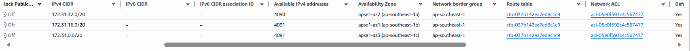
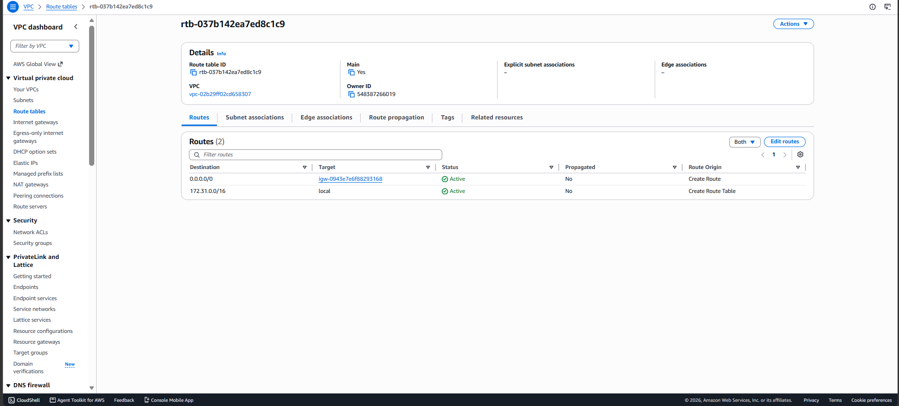
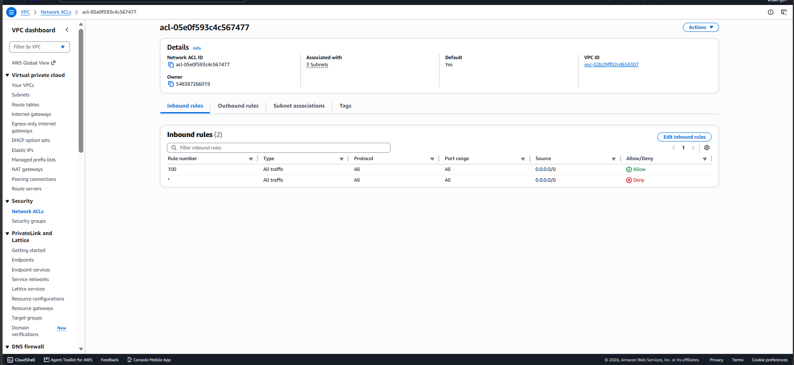
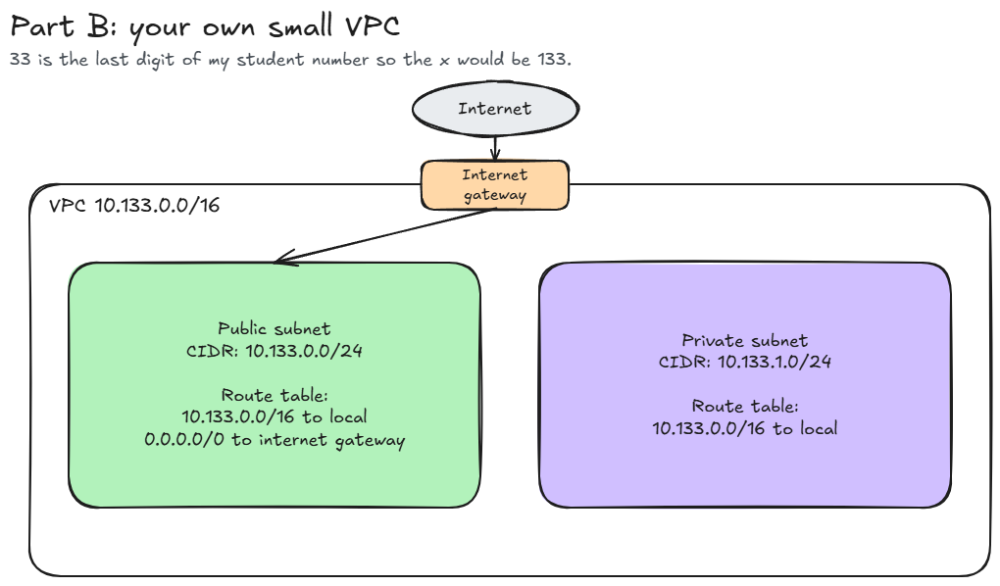

# Assignment 2 Submission

<!--
Review the answers using your own observations and wording before submitting.
Part A: use the Lab group IAM user in Singapore (ap-southeast-1).
Inspect the default VPC only; do not change resources or the shared password.
Crop the AWS account/user top bar out of all three screenshots.
Part B: X = the last two digits of your student number + 100.
Do not include your full name, full student number, or credentials in this file.
Before submitting, replace all placeholders and save the four linked images here.
Both the Pull Request and Google Form are due October 7, 2026, 11:59 PM (Asia/Manila).
-->

## About me

- GitHub username: Jerothegreat
- Section: IV-ACSAD
- IAM user name that I signed in with: acsad-g01
- X: 133

---

## Part A. Explore

### A1. The VPC

Default VPC IPv4 CIDR:

<!-- VPC > Your VPCs: select the row where Default VPC is Yes. -->
`172.31.0.0/16`

Number of addresses in that CIDR:

<!-- Calculate 2^(32 - prefix length). This is the total, before subnet reservations. -->
65,536 IPv4 addresses (`2^(32 - 16) = 65,536`).

### A2. The subnets

<!-- VPC > Subnets: include only subnets belonging to the default VPC. Add/remove rows as needed. -->
| Availability Zone | IPv4 CIDR |
| --- | --- |
| ap-southeast-1a | 172.31.32.0/20 |
| ap-southeast-1b | 172.31.16.0/20 |
| ap-southeast-1c | 172.31.0.0/20 |

Screenshot 1. Save it as `screenshot-1-subnets.png` in your folder. The image line below shows it.

### A3. Available addresses

Available IPv4 addresses in each subnet:

| Availability Zone | IPv4 CIDR | Available IPv4 addresses |
| --- | --- | --- |
| ap-southeast-1a | 172.31.32.0/20 | 4,090 |
| ap-southeast-1b | 172.31.16.0/20 | 4,091 |
| ap-southeast-1c | 172.31.0.0/20 | 4,091 |

Why is the number lower than 4,096?

<!-- Explain the five AWS-reserved addresses and any addresses allocated to network interfaces. -->
A `/20` subnet contains 4,096 IPv4 addresses, but AWS reserves five addresses in every subnet. This leaves 4,091 addresses available before any are allocated to resources. Addresses allocated to network interfaces reduce the available count further.

What uses the missing address in the subnet with the lowest number?

<!-- Identify the resource from your observations. Do not assume a Lab 2 instance still exists.
If the counts are equal, say so and explain what an allocated instance address would do. -->
The subnet in `ap-southeast-1a` has 4,090 available addresses, which is one fewer than the 4,091 available after AWS reservations. This indicates one additional private IPv4 address allocated to a network interface, such as an instance's interface. The subnet list does not identify which resource owns that interface.

### A4. The route table

<!-- VPC > Route tables > default VPC route table > Routes. Record every route.
Use target types such as local or igw-..., rather than full resource IDs. -->
| Destination | Target |
| --- | --- |
| 0.0.0.0/0 | igw-... (internet gateway) |
| 172.31.0.0/16 | local |

Screenshot 2. Save it as `screenshot-2-routes.png` in your folder. The image line below shows it.

### A5. Public or private

Are the default subnets public or private? Which route proves it?

<!-- Base the classification on the route you actually recorded in A4. -->
The default subnets are public because their route table has a route from `0.0.0.0/0` to an internet gateway (`igw-...`). This provides a route for internet traffic. The `172.31.0.0/16` route with the target `local` handles traffic within the VPC, just because its labeled as local it does not make the subnets private.

### A6. The internet gateway

State of the internet gateway:

<!-- VPC > Internet gateways: inspect the gateway attached to the default VPC. -->
Attached.

What happens to the default subnets if the gateway is detached?

The default subnets lose their direct internet connection because their internet gateway route no longer has an attached gateway to use. Instances cannot communicate with the internet through that gateway, even if they have public IPv4 addresses. Communication within the VPC can still work through the local route, provided the security groups and network ACLs allow the traffic.

### A7. NAT gateways

Number of NAT gateways:

<!-- VPC > NAT gateways: record the observed count in Singapore. -->
0. The NAT gateways page shows "No NAT gateways found."

Can a server in a new private subnet download updates? Why?

No, under the current setup. A private subnet has no direct route to an internet gateway, and there is no NAT gateway to provide an outbound internet path for downloading updates. The VPC's attached internet gateway alone does not give a private subnet internet access.

### A8. The network ACL

<!-- VPC > Network ACLs > default VPC ACL > Inbound rules. Record every rule, including *. -->
| Rule number | Source | Allow or Deny |
| --- | --- | --- |
| 100 | 0.0.0.0/0 | Allow |
| * | 0.0.0.0/0 | Deny |

How is a network ACL different from a security group?

<!-- Compare where each firewall applies, allow/deny rules, and stateful/stateless replies. -->
A network ACL applies to an entire subnet, supports allow and deny rules, and is stateless, so requests and replies need rules in their respective directions. A security group applies to resources such as instances, supports allow rules only, and is stateful, so replies to allowed traffic are automatically permitted.

Screenshot 3. Save it as `screenshot-3-network-acl.png` in your folder. The image line below shows it.

### A9. The default security group

Inbound rule (type and source):

<!-- VPC > Security groups > default group in the default VPC > Inbound rules. -->
Type: All traffic (all protocols and ports). Source: `sg-0c5b6d4081cf0a534` (`default` security group).

Which resources can send traffic to an instance that uses it?

This inbound rule allows traffic from resources whose network interfaces also use the same default security group. It does not allow traffic from every resource in the VPC or from arbitrary internet addresses; the source must belong to the referenced security group.

---

## Part B. Prepare

### B1. Plan two subnets

<!-- With your confirmed X, the public /24 starts at the VPC's first address.
The private /24 starts at the next address after the public /24 ends. -->
VPC CIDR: `10.133.0.0/16`.

- Public subnet CIDR: `10.133.0.0/24` (range: `10.133.0.0` to `10.133.0.255`).
- Private subnet CIDR: `10.133.1.0/24` (range: `10.133.1.0` to `10.133.1.255`).

### B2. Route tables

<!-- Both tables need the VPC local route. The public table also needs an internet gateway route.
Follow the assignment's small-VPC plan; do not add a NAT gateway unless your plan includes one. -->
Route table of the public subnet:

| Destination | Target |
| --- | --- |
| 10.133.0.0/16 | local |
| 0.0.0.0/0 | internet gateway |

Route table of the private subnet:

| Destination | Target |
| --- | --- |
| 10.133.0.0/16 | local |

### B3. My VPC diagram

<!-- Draw your own diagram: VPC CIDR, both subnet CIDRs, internet gateway connected
to the public subnet only, and the routes written next to each subnet.
You can open activities/assignment-2/diagrams/a2-05-your-vpc-plan.excalidraw as a starting point.
Labels for your drawing:
VPC: 10.133.0.0/16
Public subnet: 10.133.0.0/24; routes: 10.133.0.0/16 -> local, 0.0.0.0/0 -> internet gateway
Private subnet: 10.133.1.0/24; route: 10.133.0.0/16 -> local
Show the internet gateway at the VPC boundary with a traffic-path connection to the public subnet only. -->
Tool used (Excalidraw, draw.io, Lucidchart, or paper):

Excalidraw.

Save your diagram as `vpc-diagram.png` in your folder. The image line below shows it.

### B4. Predict a change

Can you still open the web page from your laptop? Why?

<!-- Consider whether a public IPv4 address is sufficient without the internet gateway route. -->
No. Deleting `0.0.0.0/0` removes the default subnet's route to the internet gateway, so I cannot open the instance's web page from my laptop over the internet. Having a public IPv4 address alone does not provide the missing route.

Can the instance still reach another instance in the VPC? Why?

<!-- Consider the remaining local route and whether security groups/network ACLs permit traffic. -->
Yes, provided the security groups and network ACLs allow the traffic. The default VPC's `172.31.0.0/16` local route remains, so the instances can still communicate using their private IP addresses within that VPC.

### B5. Place a database

Which subnet gets the database? Why?

<!-- Explain which subnet keeps the database away from direct internet access. -->
I would put the database in the private subnet, `10.133.1.0/24`, because its route table has no direct internet gateway route. Application servers in the VPC can reach it through the local route, and the database's security group should allow database traffic only from the application servers that need access.

### B6. My question about VPCs

What is your question, and what made you think of it?

<!-- Use a question you actually have after the activity, and explain what prompted it. -->
How does a company decide how much isolation its services need when designing a VPC? For example, when should a service be in a public subnet, a private subnet with outbound internet access through a NAT gateway, or a private subnet with no internet access?

I thought of this because separating subnets and configuring their routes seemed complicated to me. I understand that a private subnet can still communicate within the VPC, but I want to understand why a company would choose different levels of isolation for internal services, sensitive data, or testing environments, and how the needs of the company and its users justify the extra complexity.
