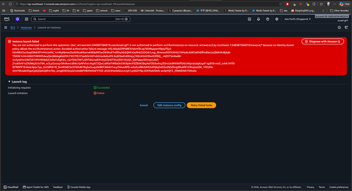
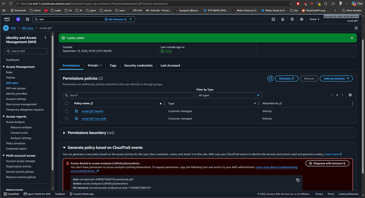
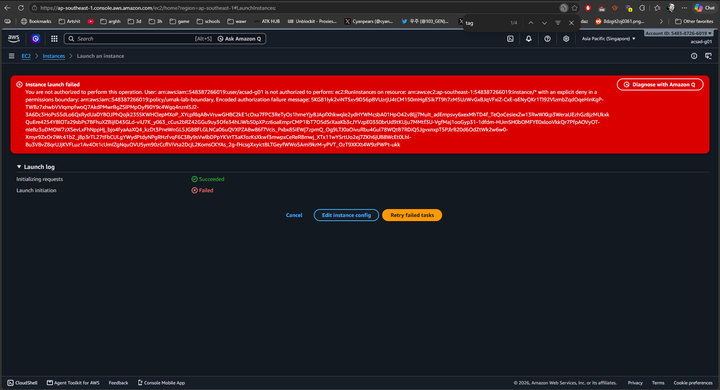
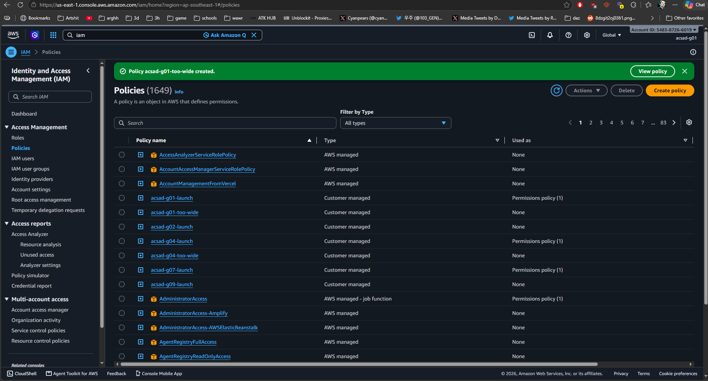

# Lab 1 Submission

## Part B
**Error Action Name:**
Instance launch failed.
You are not authorized to perform this operation. User: arn:aws:iam::548387266019:user/acsad-g01 is not authorized to perform: **ec2:RunInstances** on resource: arn:aws:ec2:ap-southeast-1:548387266019:instance/* because no identity-based policy allows the **ec2:RunInstances** action. Encoded authorization failure message: HSj-b0ydd2RFdBE2Vxbmf3Log76ONqaysnVDpiyITljul-h5irBIkV2aJ2wpDBkEGfYvMtrUoPd_YvtiNyKbmieZlstSh9zaK9omxkNE6dW5wZW5hoF7n0fDySIbSQHFzOyRh82SOGt61uvg_9hmnmDOIYcKHtU1hMa4LAhKfJsKH5fPmKbzUuQWAtRvBjAsb-TDKRk1mVrnXl6HTrWlMfhAvyQerjBbdxgkkdZDLYW27FEJYSadb5nVdTvIbXJav8sGuM9-EyBObxEUKRmjuj1XXmk5sVI3bviGXfBQ__mjfOTSm8w8K-UvXyoDmrGWZ2EY4PiH958ek32x9wfuFgKWu_cIpYD0U7W7u3NTWamalCfm8yG2kWT9twZKD1NUQX_QW3epwiGVmprLA93-j7zoKhrN1oZXdWq2LVz79A_w2LpOzxoqrOXnBwrLt8WuYpNFsfwcvhgdLTJQwLo8XIeTWBa0InZ4Obj4tnPZZlbW28qiAeFZlC6whojJSDrsUedMXWiPSA6JiWpvdudqKzgeF-tgiEVd-me3_cnHk1H7D-l0TB5PP1EJ6mjr4pozTyp_Utz5BfUl1B_9vnRtN8CSc5YSHUKYKqSwSuajuDABDTJ6k6H1ocyZVevedlFD-wGa5zsR0UUH32xflQlqZxIO5x2NGZGvg3RukFb1CRnqisxLDA_1FCUOe-iOmYDUsde55geCjelQQebQ6Fm7bo_omg6DEIOcjxGnvdo6kFHBXFAIDsFY7OZ-zKUVJHw4a0ovcmJyh1yn602YRq-0OMlwbSNrb-wciIpYQY2_Z9NNDNih70XtaGc

**Screenshot (Part B launch denial with username visible):**

## Part C
**Policy Statement Blanks:**
- `"Action"`: "ec2:RunInstances"
- `"Resource"`: "arn:aws:ec2:ap-southeast-1:548387266019:instance/*"
- `"ec2:InstanceType"`: "t3.micro"

## Part D
**Security Group Error Text:**
Instance launch failed
You are not authorized to perform this operation. User: arn:aws:iam::548387266019:user/acsad-g01 is not authorized to perform: ec2:RunInstances on resource: arn:aws:ec2:ap-southeast-1:548387266019:instance/* with an explicit deny in a permissions boundary: arn:aws:iam::548387266019:policy/umak-lab-boundary. Encoded authorization failure message: 5KG81Iyk2viNTSxv9D56pBVUzrjU4tCM150mHgESik7T9h7zM5UzWvGxBJqVFxiZ-CxE-oENyQKr1TI92VlzmbZqdOqeHinKgP-TWBz7xhwbVVIqmpfwoQ7AkdPMwrBgZSlPMpOyf90Y9c4Wgq4nznlSJ2-3A6Dc3HoPs55dLo6QxRydUaDYBOJPhQojk235SKWHClepMXoP_XYcpRlqABvVruwGHBC2kE1cOxa7FPC3ReTyOs1hmeYjyBJApfXhkwqle2ydHYWMcsbA01HpO42v8ljj7MuIt_adEmpsvy6xexMhTD4f_TeQoCesiexZw13RwWXkp3WeraUEzhGz8jzMUkxkQuEre4254Y8lOTa29sbPs7BFhuXZBijID43GLd-viU7K_y063_cCus2bRZ42GGu9uy3Ofe34hLiWb50pXPzz6oaEmprCMP1IbT7O5dSrXaaKb3cJYVzpE0350brUd9tKUju7MMtf3U-VgfMaj1ooGyp31-1dfdm-HUmSH0bOMFYE0xlooVkkQr7PfpAOVyOT-nIeBz3uDMOW7zXSevLxFhNppHj_bjo4fyaAaXQ4_kzDt3PneWnGL5JG88FLGLNCa06uQVXPZA8w86f7Vcis_Pxbx85iEWj7zpmQ_Og9LTJ0aOivuRbu4Gul78WQtB7RDiQ5JgvxnxpT5PJlrB20d6OdZtWk2w6w0-Xmyr9ZxOr2Wc41bZ_j8p3rTL27tFbCULgYWydPtdyNPgRHzfvqF6C3By9sVwlbDPpYKVrT3aKfozKsXkwf3mwpxCeReR8mwj_XTx11wYSrtUo2ej7ZKh6jUB8WcEt0Lhl-Bu3V8vZ8qrUJjKVFLuz1Av4Ot1cUmIZgNquOVU5ym90zCcflViVsa2DcjL2KomsCKYAs_2g-fHcsgXxyictBLTGeyfWWo5Ami9krM-yPVT_OzT9XKXt4W9zPWPt-ukk

**Running Instance Time:** 9:08 PM

**Screenshot 1 (Permissions tab listing acsad-g01-launch):**

**Screenshot 2 (Instance in Running state):**

## Part E
**t3.small / Tokyo Denial Error:**
Instance launch failed.
You are not authorized to perform this operation. User: arn:aws:iam::548387266019:user/acsad-g01 is not authorized to perform: **ec2:RunInstances** on resource: arn:aws:ec2:ap-southeast-1:548387266019:instance/* with an explicit deny in a permissions boundary: arn:aws:iam::548387266019:policy/umak-lab-boundary. Encoded authorization failure message: 5KG81Iyk2viNTSxv9D56pBVUzrjU4tCM150mHgESik7T9h7zM5UzWvGxBJqVFxiZ-CxE-oENyQKr1TI92VlzmbZqdOqeHinKgP-TWBz7xhwbVVIqmpfwoQ7AkdPMwrBgZSlPMpOyf90Y9c4Wgq4nznlSJ2-3A6Dc3HoPs55dLo6QxRydUaDYBOJPhQojk235SKWHClepMXoP_XYcpRlqABvVruwGHBC2kE1cOxa7FPC3ReTyOs1hmeYjyBJApfXhkwqle2ydHYWMcsbA01HpO42v8ljj7MuIt_adEmpsvy6xexMhTD4f_TeQoCesiexZw13RwWXkp3WeraUEzhGz8jzMUkxkQuEre4254Y8lOTa29sbPs7BFhuXZBijID43GLd-viU7K_y063_cCus2bRZ42GGu9uy3Ofe34hLiWb50pXPzz6oaEmprCMP1IbT7O5dSrXaaKb3cJYVzpE0350brUd9tKUju7MMtf3U-VgfMaj1ooGyp31-1dfdm-HUmSH0bOMFYE0xlooVkkQr7PfpAOVyOT-nIeBz3uDMOW7zXSevLxFhNppHj_bjo4fyaAaXQ4_kzDt3PneWnGL5JG88FLGLNCa06uQVXPZA8w86f7Vcis_Pxbx85iEWj7zpmQ_Og9LTJ0aOivuRbu4Gul78WQtB7RDiQ5JgvxnxpT5PJlrB20d6OdZtWk2w6w0-Xmyr9ZxOr2Wc41bZ_j8p3rTL27tFbCULgYWydPtdyNPgRHzfvqF6C3By9sVwlbDPpYKVrT3aKfozKsXkwf3mwpxCeReR8mwj_XTx11wYSrtUo2ej7ZKh6jUB8WcEt0Lhl-Bu3V8vZ8qrUJjKVFLuz1Av4Ot1cUmIZgNquOVU5ym90zCcflViVsa2DcjL2KomsCKYAs_2g-fHcsgXxyictBLTGeyfWWo5Ami9krM-yPVT_OzT9XKXt4W9zPWPt-ukk

**Screenshot 1 (t3.small boundary denial):**

**Extra evidence (acsad-g01-too-wide policy created):**

**Screenshot 2 (CloudTrail event showing errorMessage):**

## Part F Questions
1. Which action did the Part B error name?
   `ec2:RunInstances`
2. In your policy, which condition limits `ec2:RunInstances`?
   `"StringEquals": { "ec2:InstanceType": "t3.micro" }`
3. After you attached `ec2:*` on `*`, why was `t3.small` still denied? Name the boundary statement.
   An explicit deny always supersedes any allow statement in AWS policy evaluation; it was denied by the permissions boundary statement named `DenyAnyInstanceTypeButT3Micro`.
4. Why is `ec2:*` on `*` a poor policy even with a boundary?
   It violates the principle of least privilege by granting excessive permissions across all EC2 actions and resources, relying on guardrails to block unintended access rather than defining safe, explicit access permissions.
5. In two sentences: what does the boundary control that your policy cannot?
   A permissions boundary sets the maximum allowable permissions ceiling that an identity-based policy can grant to a principal. This ensures that even if a user creates or attaches an overly permissive policy like `ec2:*` on `*`, they cannot escalate their effective permissions beyond the outer limits enforced by the administrator.
