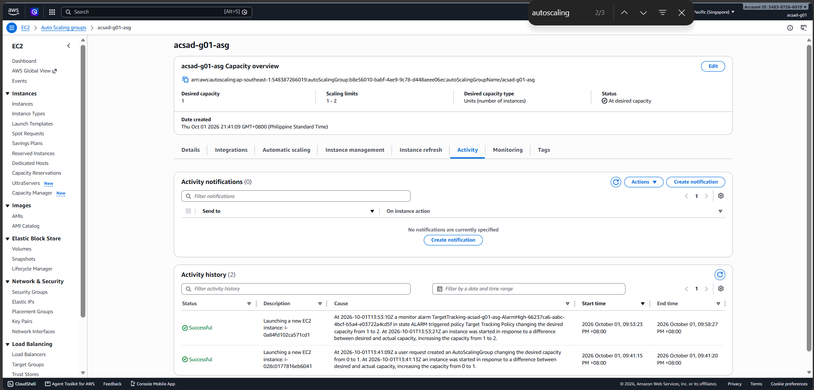
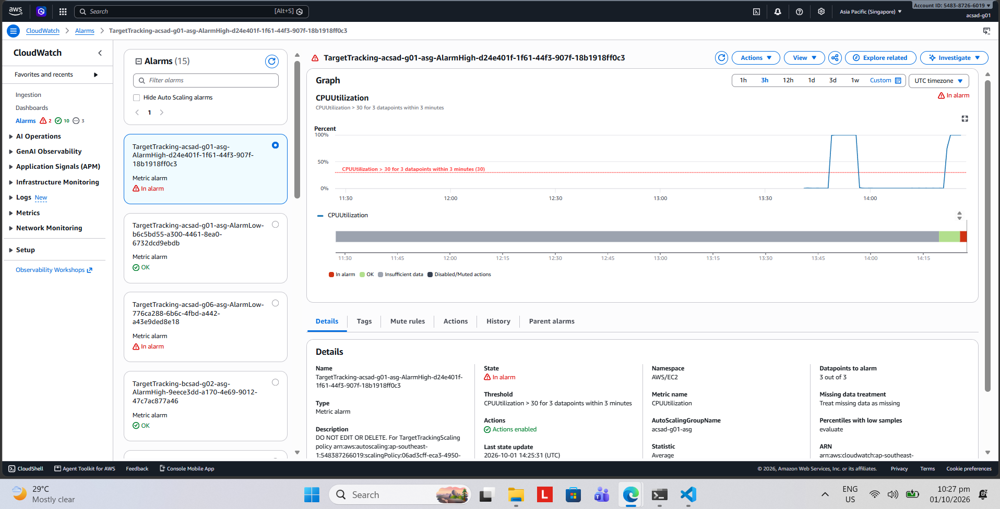

# Lab 2 working guide — Group 1

Follow this guide while performing the lab in the AWS console. Record your own results in [submission.md](submission.md), assign the actual roles in [contribution.md](contribution.md), and save evidence in [screenshots/](screenshots/README.md).

Source: the updated [official Lab 2 brief](../../../activities/lab-2/lab.md). Group 1 uses a **30% CPU target**. The IAM user `acsad-g01` comes from Group 1's Lab 1 records; confirm your current login before starting. If the instructor gives a different IAM user, replace the user name in all resource names and tag values consistently.

This working guide is retained as a reference. Sample instance IDs, times, CPU readings, and activity descriptions in this guide are illustrative; the completed [submission report](submission.md) records the team's actual observations and evidence.

## Before starting

1. Sign in with the team's IAM user. Confirm the instructor has enabled Auto Scaling for the section and Lab 1 is complete.
2. Set the AWS region to **Asia Pacific (Singapore), `ap-southeast-1`**.
3. Open the [provided user-data script](../../../activities/lab-2/lab2-user-data.sh) in your editor. You will paste its entire contents into the launch template without editing it.
4. Assign Driver, Navigator, Recorder, and Reviewer. The Recorder keeps `submission.md` open and saves screenshots as you go.
5. Use these settings throughout:

| Setting | Group 1 value |
|---|---|
| IAM user / `team` tag | `acsad-g01` |
| Security group | `acsad-g01-web` |
| Launch template | `acsad-g01-lt` |
| Auto Scaling group | `acsad-g01-asg` |
| AMI / instance type | Amazon Linux 2023 / `t3.micro` |
| CPU target / warmup | **30%** / **60 seconds** |
| Initial desired / minimum / maximum | **1 / 1 / 2** |
| VPC / subnets | Default VPC / two subnets in different Availability Zones |
| Load balancer | No load balancer |
| Lab tag | `lab=umak` |

## Step 1 — Confirm or create the security group

1. Open **EC2 → Security Groups** and search for `acsad-g01-web`.
2. If it exists from Lab 1, select it and check **Inbound rules**. Confirm **HTTP / TCP / port 80 / source `0.0.0.0/0`**. Add that rule if missing.
3. If it does not exist, choose **Create security group**. Set name `acsad-g01-web`, description `Lab 2`, and the default VPC.
4. Add the HTTP inbound rule above. Leave the default outbound rule as **All traffic / All ports / `0.0.0.0/0`**.
5. Add tag `team=acsad-g01` and create the group.

**Expected result:** The security group exists in the VPC you will use, with HTTP access on port 80.

**Screenshot:** `01-security-group.png`, showing the group name and inbound rule.

## Step 2 — Create the launch template

1. Open **EC2 → Launch Templates → Create launch template**.
2. Name: `acsad-g01-lt`. Version description: `Lab 2`.
3. Tick **Provide guidance to help me set up a template that I can use with EC2 Auto Scaling**.
4. Under **Template tags**, add `team=acsad-g01`.
5. Choose **Quick Start → Amazon Linux 2023 AMI** and instance type **`t3.micro`**.
6. For key pair, choose **Don't include in launch template**.
7. Under network settings, leave the subnet as **Don't include in launch template**. Select security group **`acsad-g01-web`**.
8. Under **Resource tags**, add the following three tags, each applying to **Instances**: `team=acsad-g01`, `lab=umak`, and `Name=acsad-g01-web`.
9. Expand **Advanced details**. Set **Detailed CloudWatch monitoring → Enable**.
10. In **User data**, paste the whole supplied `lab2-user-data.sh`, starting with `#!/bin/bash` and ending with `systemctl enable --now labapp.service`.
11. Choose **Create launch template** and check the success message.

**Expected result:** `acsad-g01-lt` exists with the settings above. The supplied script starts a Python web service on port 80 when an instance boots.

**Screenshots:** `02-launch-template.png` and, if necessary, `02b-detailed-monitoring.png`. Capture the AMI, instance type, security group, and detailed monitoring setting legibly.

## Step 3 — Create the Auto Scaling group

1. Open **EC2 → Auto Scaling Groups → Create Auto Scaling group**.
2. Name: **`acsad-g01-asg`**. Choose launch template **`acsad-g01-lt`**, version **Latest**, then Next.
3. Choose the **default VPC** and **two subnets in different Availability Zones**. Record which zones you selected.
4. Choose **No load balancer**. Leave health checks as **EC2**. Enable **group metrics collection within CloudWatch**.
5. Set **Desired capacity 1**, **Minimum capacity 1**, and **Maximum capacity 2**.
6. Choose **Target tracking scaling policy**. Metric: **Average CPU utilization**. Target: **30**. Instance warmup: **60 seconds**.
7. Leave notifications unchanged.
8. Add tags **`team=acsad-g01`** and **`lab=umak`**, ticking **Tag new instances** for both.
9. Review the values and choose **Create Auto Scaling group**.

**Expected result:** The group begins launching one instance. Initial desired/minimum/maximum are `1/1/2`. The target tracking policy manages its own CloudWatch alarms; you do not need to create a separate alarm.

**Screenshots:** `03-scaling-policy.png` showing CPU target **30** and warmup **60**, plus `03b-capacity.png` if necessary to show `1/1/2` and the group name.

If AWS returns an authorization error, copy its full text and report the denied action and resource to the instructor, as the brief directs.

## Step 4 — Record the first instance

1. Select **`acsad-g01-asg` → Instance management**.
2. Wait for one instance with lifecycle **InService**. Open its instance ID and copy its **Public IPv4 address**.
3. In a new browser tab, open **`http://<first-public-ip>`**, explicitly using HTTP.
4. Copy the displayed instance ID and Availability Zone into **First Instance** in `submission.md`.

**Illustrative browser output:**

```text
UMak Cloud Computing Lab 2
instance-id: i-0123456789abcdef0
availability-zone: ap-southeast-1a
instance-type: t3.micro
uptime-seconds: 120
burning: False
Try /burn, /stop, /health
```

Your instance ID, zone, and uptime will differ. Opening `http://<first-public-ip>/health` should return `ok`.

**Screenshot:** `04-first-instance.png`, including the instance ID, Availability Zone, and instance type.

## Step 5 — Trigger load and capture scale-out evidence

Have the Recorder ready: the alarm evidence is easiest to capture while the load is still running.

1. Open **`http://<first-public-ip>/burn`** and record the start time.
2. The exact response from the supplied script is:

   ```text
   Burning both vCPUs for up to 8 minutes. Watch CloudWatch and the Auto Scaling Activity tab.
   ```

3. Open the group's **Monitoring → EC2** view and watch **Average CPU utilization**. The brief expects CPU to rise within roughly **1–3 minutes**. Allow time for metric updates; refresh as needed.
4. In another tab, open **CloudWatch → Alarms → All alarms** in Singapore. Locate the target tracking **high-CPU** alarm for `acsad-g01-asg`. Check its details/metric dimensions to ensure it belongs to your group rather than another team's group or the low-CPU alarm.
5. When that alarm shows **In alarm / ALARM**, capture **`05-cloudwatch-alarm.png` immediately**, including the alarm name, state, and metric graph. Do this before stopping the load. Alarm names and exact evaluation thresholds are managed by AWS; verify your policy target separately as **30%**.
6. Return to **`acsad-g01-asg` → Activity**. The brief expects a scale-out launch within roughly **3–6 minutes**. Capture **`06-scale-out-activity.png`**, showing the launch event, time, cause, and status. If it is still in progress, refresh and capture its completed result too.
7. Open **Instance management**. Wait until **two different instances are InService**. Capture **`07-two-inservice.png`**.
8. Open the second instance's public IP over HTTP. Record its ID and Availability Zone under **Second Instance** in `submission.md`. Capture **`08-second-instance.png`**.
9. Once the required alarm and scale-out evidence is saved, open **`http://<first-public-ip>/stop`**. The response is:

   ```text
   Burn stopped.
   ```

10. Watch the CPU chart and save **`09-cpu-chart.png`**. CPU metrics can take time to reflect the stopped load. Record your observed utilization, alarm state, and times in `submission.md`.

**Illustrative scale-out result:**

```text
Auto Scaling group: acsad-g01-asg
Desired capacity: 2
Minimum capacity: 1
Maximum capacity: 2
First instance:  i-0123456789abcdef0  InService  ap-southeast-1a
Second instance: i-0fedcba9876543210  InService  ap-southeast-1b
Activity: Launching a new EC2 instance
Status: Successful
```

The activity wording and identifiers will differ. Use your actual console result. Opening the second instance should show the same page format as Step 4, with a different instance ID.

**Interpretation:** The new instance demonstrates added capacity. There is no load balancer, so the stress process on the first instance stays on that instance; it is not transferred to the second one. With one busy instance and one idle instance, group average CPU may remain above 30%, but the group cannot scale above its configured maximum of 2.

The official README and submission template specifically request the alarm in **In alarm**. Although one step in the brief permits a CPU chart, capture the actual alarm state as well to satisfy all the instructions.

## Step 6 — Demonstrate automatic replacement

1. Confirm the group has two InService instances. Record the ID of the instance you will terminate.
2. Open **EC2 → Instances**. Select **only that recorded group instance**.
3. Choose **Instance state → Terminate (delete) instance**, check the selected ID, and confirm.
4. Return to **`acsad-g01-asg` → Activity**. Watch for a replacement launch. Then check **Instance management** for the new instance reaching **InService**.
5. Record the terminated ID, replacement ID, replacement zone, and activity status in `submission.md`.

**Illustrative result:**

```text
Manually terminated: i-0123456789abcdef0
Replacement launched: i-0a1b2c3d4e5f67890
Replacement lifecycle: InService
Replacement launch activity: Successful
```

**Screenshot:** `10-replacement-activity.png`. Add an Instance management screenshot if needed to show the replacement is InService. AWS maintains the group's desired capacity, so deleting an individual instance does not remove the group or prevent replacement.

## Step 7 — Clean up after capturing evidence

1. Check that your required alarm and scale-out screenshots, two instance IDs/zones, and replacement evidence have been saved.
2. Open **EC2 → Auto Scaling Groups**. Select **`acsad-g01-asg` → Delete**, type **`delete`**, and confirm.
3. Wait for deletion and instance termination. Search for `acsad-g01-asg` and capture **`11-cleanup-asg.png`** when no matching group remains. Check the recorded instance IDs in EC2 and capture **`12-cleanup-instances.png`** when they show **Terminated**.
4. Open **EC2 → Launch Templates**. Select **`acsad-g01-lt` → Actions → Delete template** and confirm. Capture **`13-cleanup-template.png`** after searching for the deleted template.
5. Open **EC2 → Security Groups**. Select **`acsad-g01-web` → Actions → Delete security group**. If AWS says it is still in use while instances shut down, wait about a minute and retry. Capture **`14-cleanup-security-group.png`** after searching for the deleted group.
6. Record your actual cleanup result in `submission.md`, including any resource that could not be deleted and its error.

**Expected result:** The group and launch template are deleted, their lab instances are terminated, and the lab security group is deleted.

The script's **8-minute burn timeout stops the stress process**, not the EC2 instances or Auto Scaling group. The instructor's automatic cutoff mentioned in the brief is separate; complete manual cleanup instead of waiting for it.

## Finish the submission

1. After Step 7, answer the five official questions in your own words using your observations. For Group 1, discuss the assigned **30%** target. For the automatic-cutoff question, use the instructor's stated behavior; the supplied script itself does not implement group deletion.
2. Fill the contribution table with the actual roles for Steps 1–2, 3–4, and 5–7. The roster is provided; roles remain blank until you record them.
3. Replace every `<answer>` and screenshot placeholder in `submission.md`. Embed the saved screenshots with relative paths, for example:

   ```markdown
   
   
   ```

4. Verify all IDs match the screenshots and every embedded image opens. Remove unused working notes/placeholders from the final report.
5. Keep all Lab 2 submission changes inside **`submissions/lab-2/group-1/`**. This activity has **no `check.sh`** and is graded manually; a green repository check alone does not prove the AWS lab worked.
6. When the evidence and answers are complete, run these commands from the repository root in PowerShell. The prepared branch is `lab-2-group-1`, based on the updated `upstream/main`.

   ```powershell
   git branch --show-current
   git status --short
   git diff --name-only upstream/main...HEAD
   git add -- submissions/lab-2/group-1
   git diff --cached --stat
   git commit -m "lab-2: submit Auto Scaling lab evidence for group-1"
   git diff --name-only upstream/main...HEAD
   git push -u origin lab-2-group-1
   ```

   Before committing, check the staged summary contains only this folder. After committing, the comparison should list only `submissions/lab-2/group-1/` files. Untracked files appear in `git status`, not in the pre-commit comparison.

7. Open a PR from **`Jerothegreat/umak-elec3-acsad:lab-2-group-1`** to **`ahleksu/umak-elec3-acsad:main`**. Fill the PR template and check the Files changed tab for folder isolation.
8. Wait for the repository check, submit the PR link and peer evaluation to **https://forms.gle/RXFYNovBxpX4bA6z9**, and **do not merge your own PR**.

## If an expected result is missing

| Symptom | What to check |
|---|---|
| Access denied creating template/group | Save the full error and report the denied action/resource to the instructor. |
| First page does not open | Confirm InService, HTTP URL, public IPv4 address, port 80 rule, correct VPC/security group, and complete user-data script. Boot can take time. If there is no public IP, check the selected subnet's public-IP/network configuration with the instructor. |
| CPU rises but no second instance | Confirm Group 1 target 30, maximum 2, detailed monitoring enabled, and correct target tracking policy. Check this group's alarm and Activity tab for missing data or launch failures. |
| Alarm remains INSUFFICIENT_DATA | Wait for metric samples and verify detailed monitoring and the alarm's group dimension. Do not edit the AWS-managed target tracking alarm. |
| Alarm screenshot was missed | Inspect the alarm's History for the transition and save available evidence. Tell the instructor if the requested current-state proof was missed; do not substitute a fabricated image. |
| Security group deletion fails | Confirm the group is deleted and instances have terminated; wait and retry after attached network interfaces are released. Save any persistent error. |

## AWS references checked for this guide

- [Target tracking scaling policies](https://docs.aws.amazon.com/autoscaling/ec2/userguide/as-scaling-target-tracking.html): AWS manages the policy's alarms; detailed monitoring provides one-minute EC2 metrics.
- [Dynamic scaling](https://docs.aws.amazon.com/autoscaling/ec2/userguide/as-scale-based-on-demand.html): group CPU is aggregated across instances, and scaling respects the minimum/maximum limits.
- [Delete Auto Scaling infrastructure](https://docs.aws.amazon.com/autoscaling/ec2/userguide/as-process-shutdown.html): console group deletion also terminates its instances and removes associated scaling resources.
