# Lab 2 Submission

## Team and Configuration

- Team: Group 1
- IAM user: acsad-g01
- Region: Asia Pacific (Singapore), ap-southeast-1
- Security group: acsad-g01-web
- Launch template: acsad-g01-lt
- Auto Scaling group: acsad-g01-asg
- Assigned CPU target: 30%
- Observed policy before correction: Average CPU utilization target 85%; instance warmup 300 seconds.
- Verified corrected policy: Average CPU utilization target 30%; instance warmup 60 seconds; target tracking and scale-in enabled. Successful save, high-CPU alarm In alarm, successful corrected-run scale-out, and two healthy InService instances confirmed by screenshots.
- Initial desired / minimum / maximum capacity: 1 / 1 / 2
- Date and time of lab: October 1, 2026, Philippine time. Group creation recorded at 9:41:09 PM; supplied cleanup screenshots show approximately 10:53–10:55 PM.

## Instance Tracking

**First Instance**
- Instance ID: i-028c0177816eb6041
- Availability Zone: ap-southeast-1a

**Second Instance**
- Instance ID: i-0a84fd102ca571cd1
- Availability Zone: ap-southeast-1b

**Corrected run — existing load instance**
- Instance ID: i-0a84fd102ca571cd1
- Availability Zone: ap-southeast-1b
- Public IPv4 address: 54.151.163.46

**Corrected run — newly launched instance**
- Instance ID: i-0a94f341522f9fc8a
- Availability Zone: ap-southeast-1a
- Public IPv4 address: 13.212.78.168
- Lifecycle and health: InService, Healthy

**Replacement Instance (Step 6)**
- Instance ID terminated manually: i-0a94f341522f9fc8a
- Replacement instance ID: i-0c068db1206f2746c
- Replacement Availability Zone ID: apse1-az2 (region-based name is truncated in the supplied screenshot)
- Replacement activity status: Successful; replacement lifecycle InService and health Healthy

## Proof (Screenshots)

Evidence is labeled by run. The initial scale-out and historical alarm screenshots document target 85% and warmup 300 seconds. The corrected policy is verified at Group 1's required target 30% and warmup 60 seconds. The corrected run has the high-CPU alarm In alarm, successful scale-out from 1 to 2, two healthy InService instances, both instance IDs/zones, the new instance's HTTP page, an explicit stop response, a CPU chart showing the latest spike falling near 0%, and the subsequent Activity view. Step 6 manual termination and successful replacement are confirmed below. The team reports all Step 7 resources deleted; cleanup screenshots and their limits are recorded below.

1. **Activity History — corrected run:** At `2026-10-01T14:25:31Z` (10:25:31 PM Philippine time), the corrected policy's high-CPU alarm entered ALARM and triggered the target tracking policy to change desired capacity from 1 to 2. The successful launch of `i-0a94f341522f9fc8a` started at 10:25:38 PM and ended at 10:26:42 PM Philippine time. The cause confirms capacity increased from 1 to 2. Activity completion time is distinct from the exact InService transition time.

   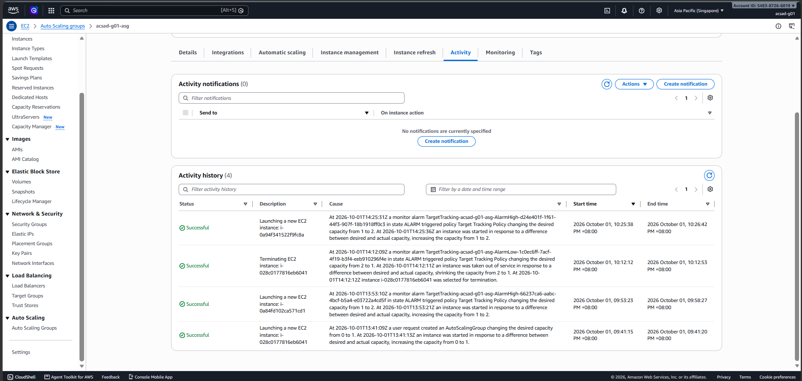

   **Initial run:** The earlier successful launch of `i-0a84fd102ca571cd1` was triggered at `2026-10-01T13:53:10Z` under the initial 85% policy. Its launch activity started at 9:53:23 PM and ended at 9:58:27 PM Philippine time.

   

2. **CloudWatch Alarm — corrected run:** The selected `TargetTracking-acsad-g01-asg-AlarmHigh-d24e401f-1f61-44f3-907f-18b1918ff0c3` shows In alarm in its graph and Details panel. The condition is CPUUtilization > 30 for 3 datapoints within 3 minutes, with AutoScalingGroupName `acsad-g01-asg` and actions enabled. The Details panel shows last state update `2026-10-01 14:25:31` UTC (10:25:31 PM Philippine time). The CPU graph's new rise is near 100%. This confirms the required current In alarm screenshot for the corrected policy.

   

   **Initial run history:** The earlier alarm History tab records OK → In alarm at `2026-10-01 13:53:10` UTC (9:53:10 PM Philippine time), successful policy execution at the same timestamp, and In alarm → OK at `13:59:10` UTC (9:59:10 PM Philippine time). Its current state at that earlier screenshot capture was OK.

   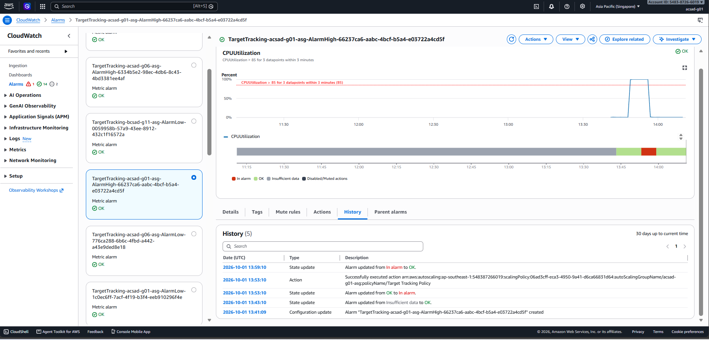

   The earlier alarm list shows `TargetTracking-acsad-g01-asg-AlarmHigh-66237ca6-aabc-4bcf-b5a4-e03722a4cd5f` OK at capture, with last state update `2026-10-01 13:59:10` UTC and condition CPUUtilization > 85 for 3 datapoints within 3 minutes. It documents the initial configuration; corrected-run alarm evidence is shown above.

   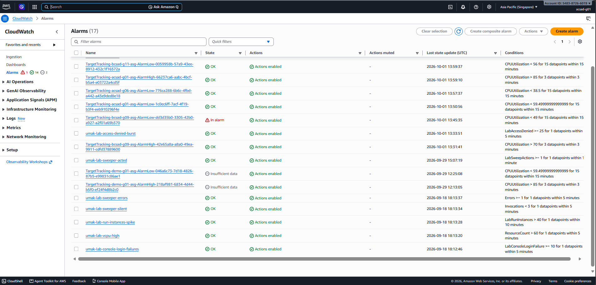

3. **Additional evidence:** The sections below include instance pages, two instances InService, replacement activity, and cleanup screenshots. The [screenshot checklist](screenshots/README.md) identifies the supporting files and any views that were not captured.

### Step 1 — Existing security group

The existing `acsad-g01-web` security group (`sg-03b64f1aa187c30de`) has an inbound HTTP rule using TCP port 80 with source `0.0.0.0/0`, as required by Step 1, item 3 of `lab.md`.

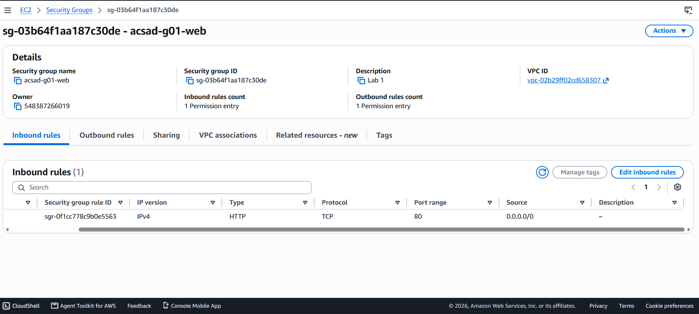

### Step 3 — Auto Scaling group created

The success message confirms creation of `acsad-g01-asg` with one scaling policy and group metrics collection enabled. The group uses `acsad-g01-lt`, version Latest, with initial desired/minimum/maximum capacity of `1/1/2`. At the time of this screenshot, the group shows `Updating capacity` with zero instances; the first instance reaching InService is still to be recorded in Step 4. The CPU target and warmup settings are not visible in this image.

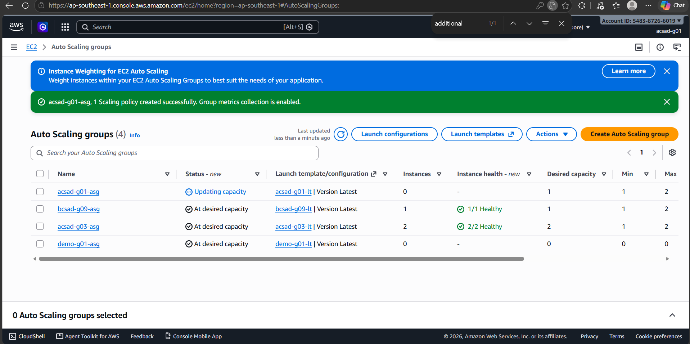

### Step 3, item 5 — Policy configuration before correction

Before correction, the enabled Target Tracking Policy was configured to maintain Average CPU utilization at 85, with instance warmup of 300 seconds and scale-in enabled. Group 1 requires target 30 and warmup 60 seconds under `lab.md`. The corrected settings are verified below.

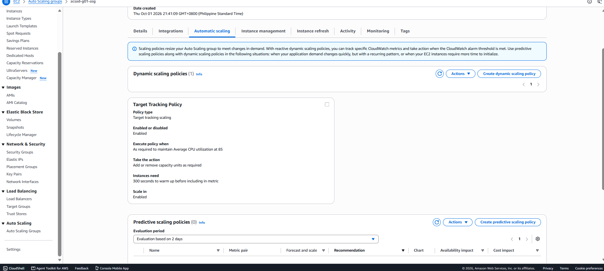

### Step 3, item 5 — Corrected policy verified

The success message confirms the dynamic scaling policy was created or edited successfully. The enabled Target Tracking Policy now maintains Average CPU utilization at 30 and uses 60 seconds of instance warmup, with scale-in enabled. These settings match Group 1's assigned parameters. The corrected-run alarm and scale-out evidence are recorded above.

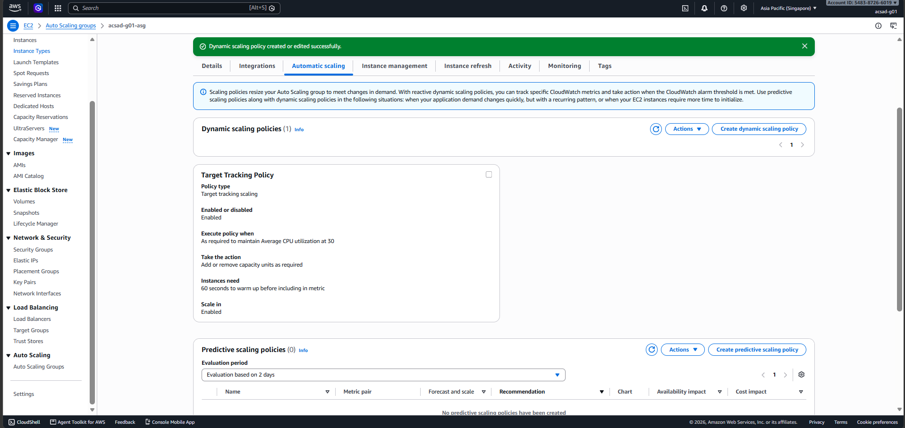

### Step 5, item 1 — Load requested after policy correction

Opening `http://54.151.163.46/burn` after the policy correction returned `Burning both vCPUs for up to 8 minutes. Watch CloudWatch and the Auto Scaling Activity tab.` This records the load request on `i-0a84fd102ca571cd1`. Subsequent evidence shows a CPU rise near 100%, the corrected high-CPU alarm In alarm, and successful capacity growth from 1 to 2 in Activity History.

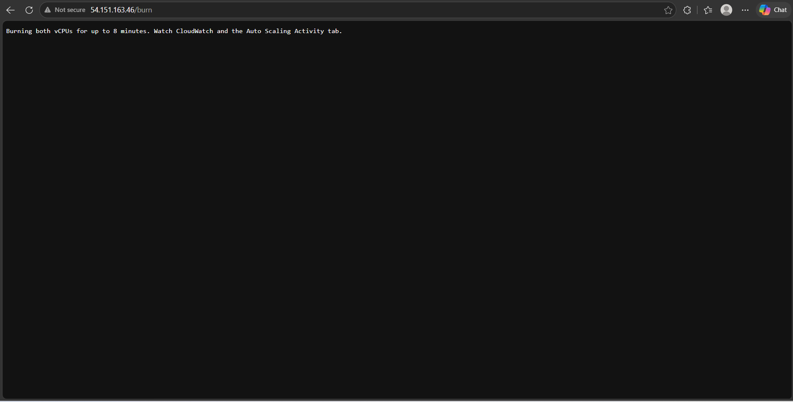

### Repeat-run monitoring and alarm selection

The supplied group Monitoring → EC2 view shows the earlier CPU spike and low readings at its right edge. It does not yet establish the new load's rise in that view.

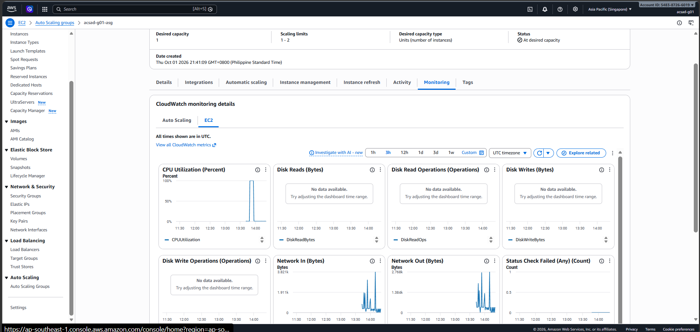

The earlier repeat-run CloudWatch screenshot has AlarmLow selected, with condition CPUUtilization < 21 for 15 datapoints within 15 minutes and state OK. Its graph shows a second CPU rise near 100%; AlarmHigh was still OK in that screenshot. Later evidence above confirms the high alarm In alarm and successful scale-out for the corrected run.

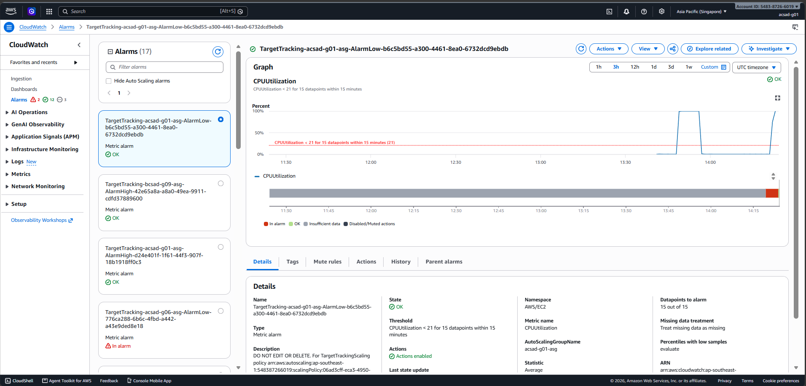

### Step 5, item 4 — Corrected run: two instances InService

The group table shows `i-0a84fd102ca571cd1` and `i-0a94f341522f9fc8a`, both t3.micro, InService, and Healthy. Their displayed zone IDs are apse1-az1 and apse1-az2, respectively. Their region-based zone names are confirmed by the HTTP pages as ap-southeast-1b and ap-southeast-1a.

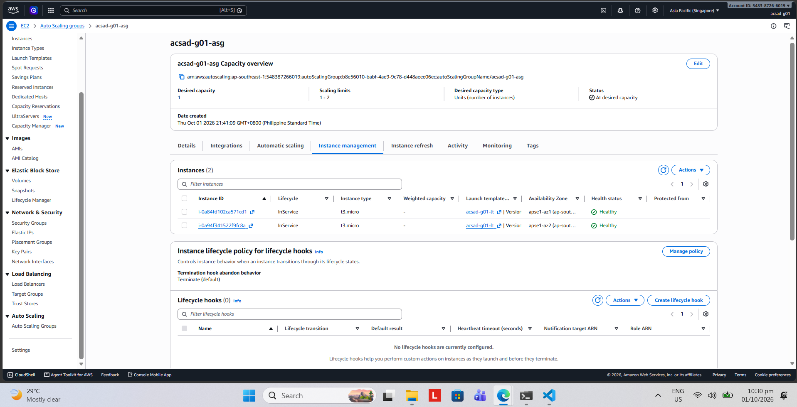

The HTTP page supplied with this table is the existing load instance `i-0a84fd102ca571cd1` at `54.151.163.46`, in `ap-southeast-1b`, with uptime 2235 seconds and burning False at capture. It is not the new instance's HTTP page and does not show an explicit repeat-run `/stop` request.

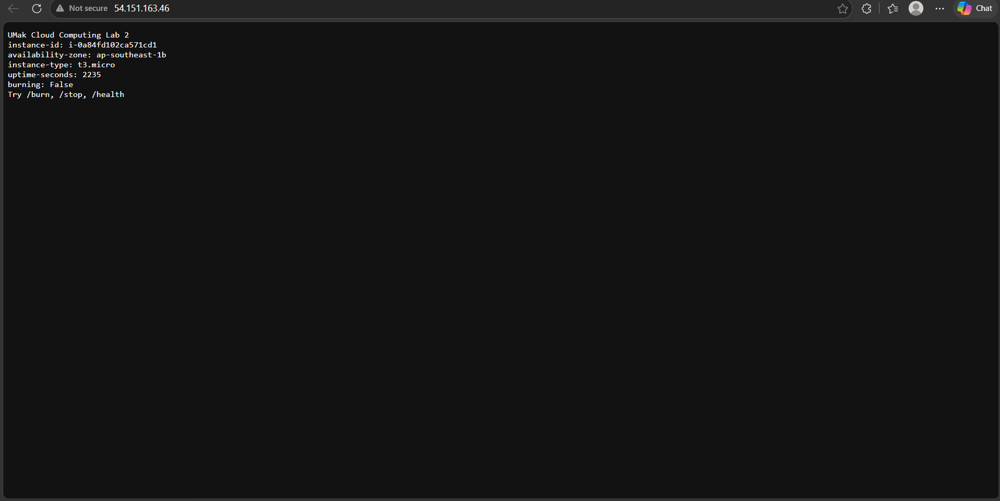

A refreshed page again shows the existing load instance `i-0a84fd102ca571cd1` in `ap-southeast-1b`, burning False, now with uptime 2467 seconds. The new instance's HTTP page is recorded separately below.

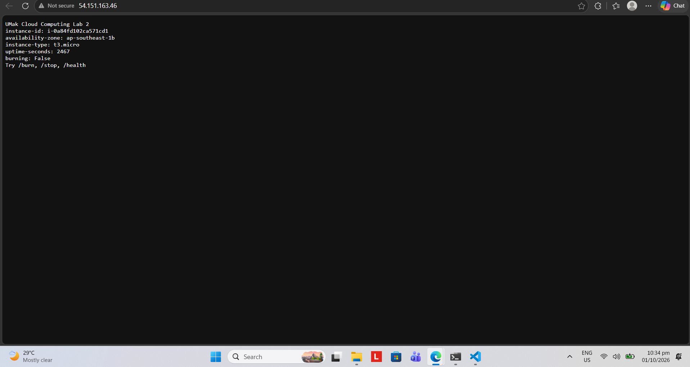

### Step 5, item 5 — Corrected-run new instance HTTP page

Opening `http://13.212.78.168` shows `i-0a94f341522f9fc8a`, Availability Zone `ap-southeast-1a`, type `t3.micro`, uptime 890 seconds, and burning False. This confirms the newly launched instance's HTTP service and zone, distinct from the load instance in ap-southeast-1b.

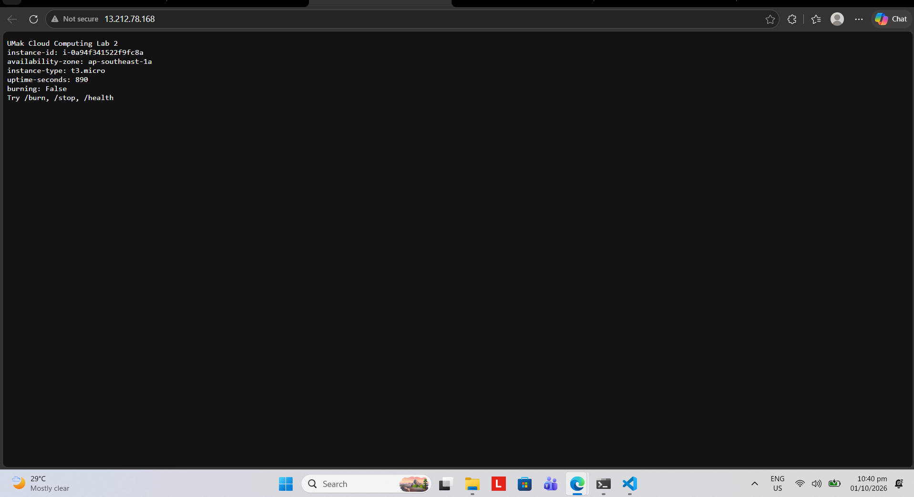

### Step 5, item 6 — Corrected-run stop response

Opening `http://54.151.163.46/stop` explicitly returned `Burn stopped.`. The screenshot's taskbar shows 10:35 PM on October 1, 2026; this is capture context, not an exact request timestamp. The subsequent Monitoring → EC2 CPU chart is recorded below for item 7.

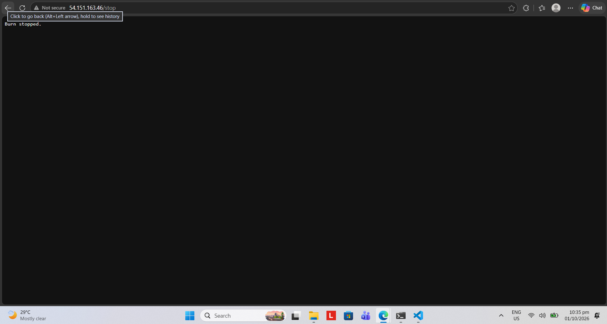

### Step 5, item 7 — Corrected-run CPU chart

The group Monitoring → EC2 CPU Utilization (Percent) chart shows the earlier load spike and the corrected run's later spike. The latest spike rises near 100%, falls through approximately 50%, and returns near 0%. The supplied screenshot follows the corrected-run `/stop` response and shows 10:37 PM Philippine time on the taskbar; chart times are displayed in UTC. Values are approximate visual readings, without data-point tooltips.

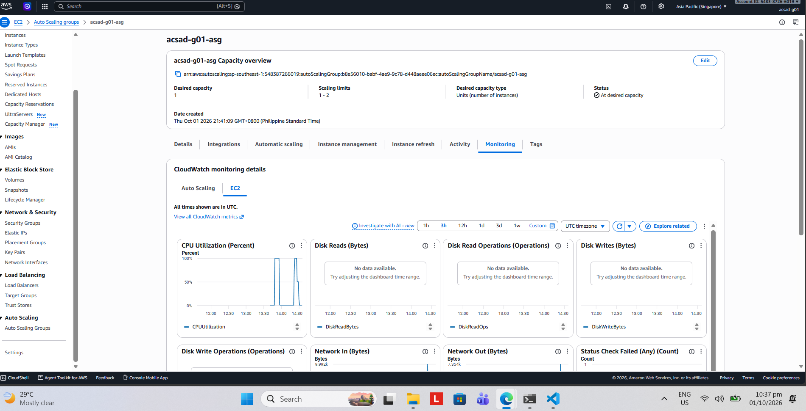

### Step 5, item 8 — Activity view after stopping load

The supplied Activity view after the corrected-run stop response and CPU chart retains four successful activities, including the corrected-run launch of `i-0a94f341522f9fc8a` ending at 10:26:42 PM. No manual replacement activity is present in this screenshot. The taskbar shows 10:39 PM Philippine time at capture.

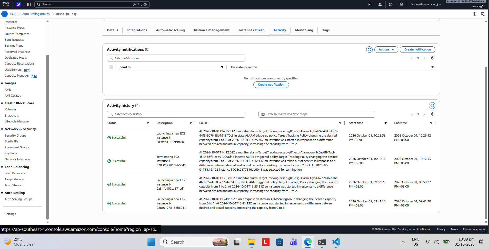

The corrected-run Activity History also records that the initial instance `i-028c0177816eb6041` was automatically terminated by the earlier low-CPU alarm, with desired capacity changing from 2 to 1 at 10:12:09 PM Philippine time. This was automatic scale-in, not the manual termination required by Step 6.

### Step 5, item 4 — Two instances InService

The Instance management tab for `acsad-g01-asg` shows `i-028c0177816eb6041` and `i-0a84fd102ca571cd1`, both `t3.micro`, InService, and Healthy. Their displayed Availability Zone IDs are `apse1-az2` and `apse1-az1`, respectively. The second instance's region-based zone name is truncated in this console screenshot and is confirmed as `ap-southeast-1b` by its HTTP page below. The scaling cause is documented in Activity History and CloudWatch alarm History above.

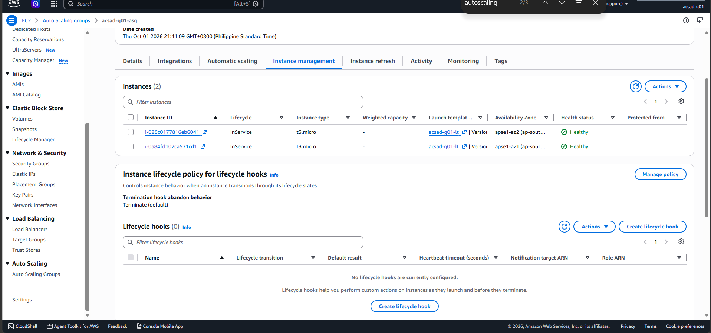

### Step 5, item 5 — Second instance details

The second instance `i-0a84fd102ca571cd1` is Running with public IPv4 address `54.151.163.46` and belongs to `acsad-g01-asg`. Its instance type is `t3.micro`, and the visible Monitoring field shows `detailed`.

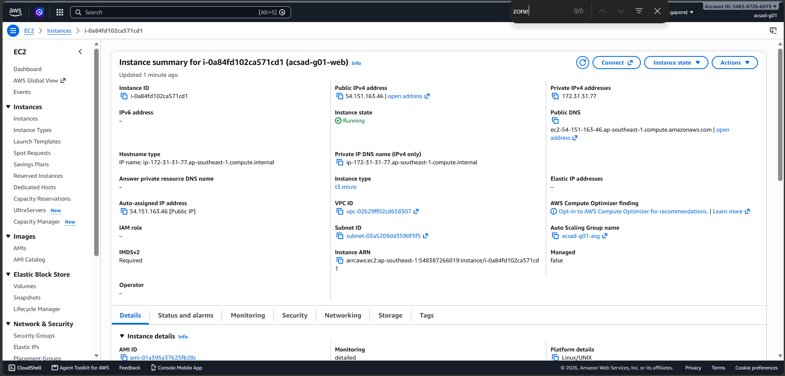

The second instance's HTTP page displays instance ID `i-0a84fd102ca571cd1`, Availability Zone `ap-southeast-1b`, instance type `t3.micro`, uptime of 289 seconds, and `burning: False` at capture time. This burn status applies to the second instance; it does not establish whether the load on the first instance has stopped.

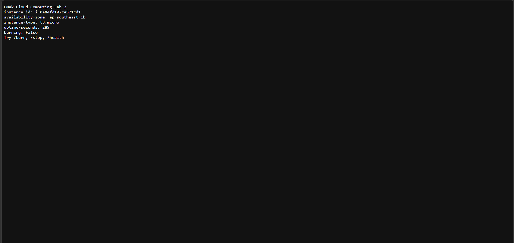

### Step 5, item 6 — Stop response

Opening `http://47.131.225.190/stop` returned `Burn stopped.`. The endpoint response is captured below, followed by the subsequent CPU chart.

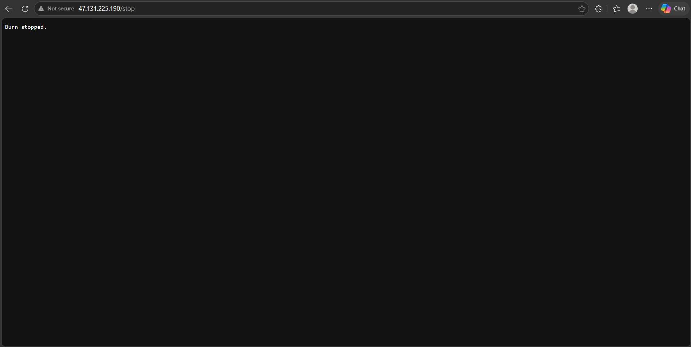

### Step 5 — Group capacity metrics

The Auto Scaling monitoring view shows group metrics collection enabled, minimum size 1, maximum size 2, and historical desired capacity and InService counts rising from 1 to 2. These are capacity metrics; the EC2 CPU utilization chart is separate. The capacity overview in the Activity screenshot displays desired capacity 1, so the current state should be refreshed before the manual replacement step rather than inferred from historical graphs.

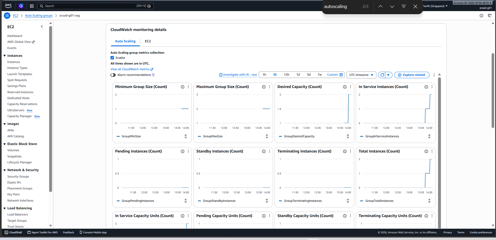

### Step 5, item 7 — CPU utilization chart

The group's Monitoring → EC2 chart shows CPU utilization rising to approximately 100% and then falling near 0%. This screenshot was supplied after the `/stop` response. Exact data-point values and times were not captured in a tooltip. The CloudWatch alarm's historical state transitions are recorded above.

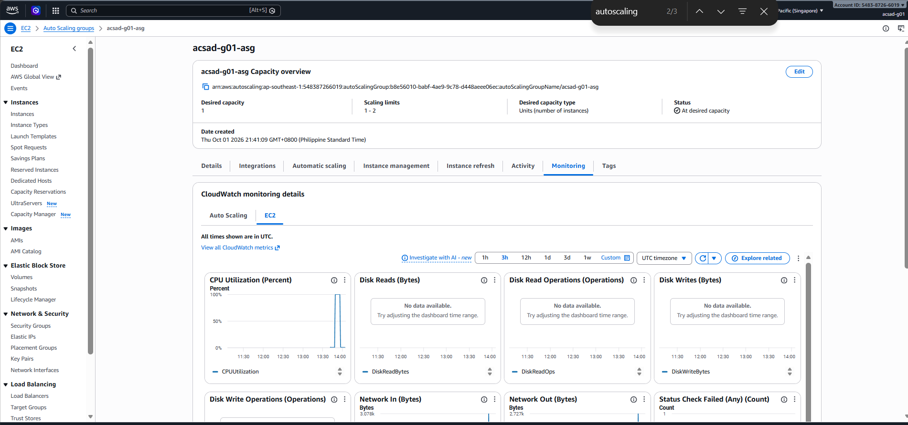

## Observations

### Step 6 — State before manual replacement

The earlier EC2 Instances screenshots show the initial instance `i-028c0177816eb6041` selected but already Terminated. Its automatic scale-in is recorded in Activity History; this is distinct from Step 6. At that earlier capture, `i-0a94f341522f9fc8a` was Running with 3/3 status checks passed and public IP `13.212.78.168`. The subsequent manual termination and replacement are recorded below.

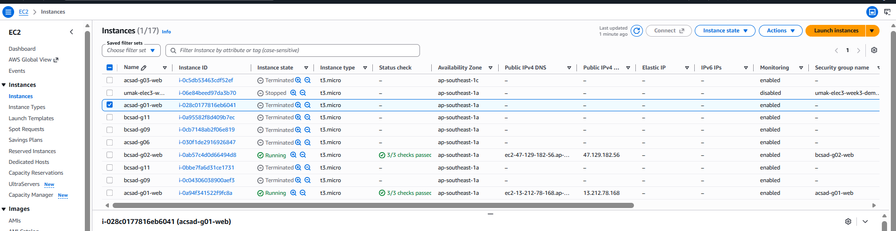

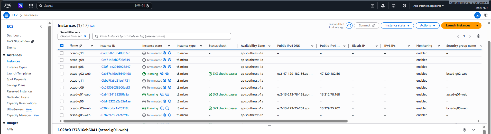

### Step 6 — Manual termination and replacement confirmed

The console success message confirms termination was initiated for `i-0a94f341522f9fc8a`, with its Details panel showing Shutting-down.

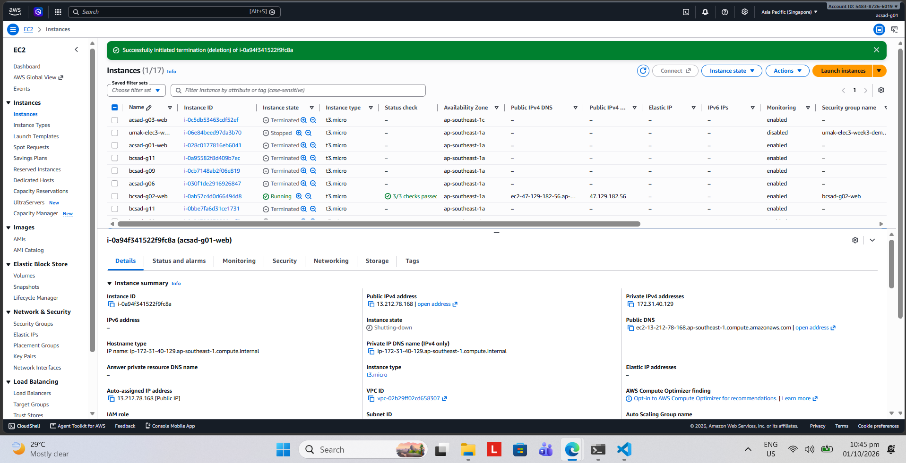

Activity History records that the instance was removed from service at `2026-10-01T14:47:09Z` after an EC2 health check indicated it was terminated or stopped. The replacement launch was started in response to an unhealthy instance needing replacement. Its activity for `i-0c068db1206f2746c` started at 10:47:11 PM and ended at 10:47:15 PM Philippine time with status Successful.

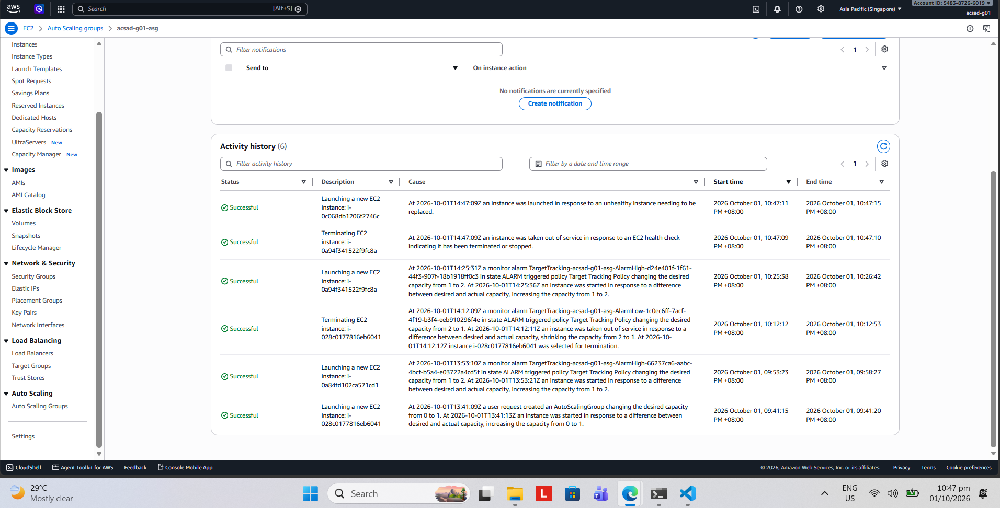

Instance management shows the existing `i-0a84fd102ca571cd1` and replacement `i-0c068db1206f2746c`, both t3.micro, InService, and Healthy. The capacity overview now shows desired capacity 2 with limits 1–2. The replacement's visible zone ID is apse1-az2; its region-based name is truncated.

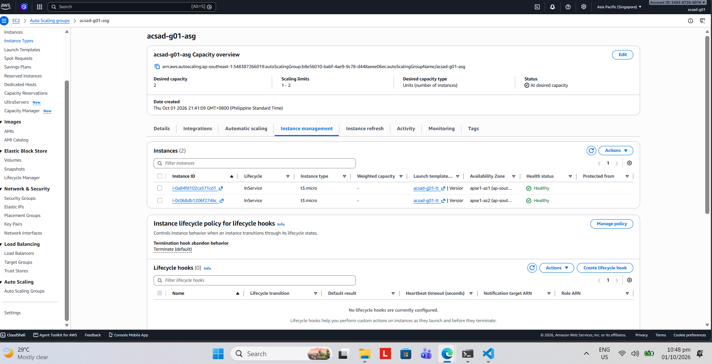

### Step 7 — Cleanup

The team confirmed that the Auto Scaling group, launch template, and security group are now all deleted. The supplied screenshots document these stages:

- `acsad-g01-asg`: Deleting at capture, with desired/minimum/maximum set to 0/0/0 and one instance still listed. This image records deletion in progress; it is not a final no-matching-group or all-instances-Terminated view.
- Launch template: console banner states `Delete launch template request succeeded`, and `acsad-g01-lt` is absent from the displayed list.
- `acsad-g01-web` (`sg-03b64f1aa187c30de`): console banner explicitly states successfully deleted. The table still displays its row at capture, so the banner is the deletion evidence rather than a refreshed absence view.

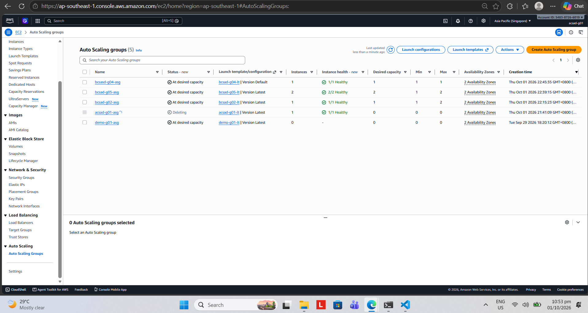

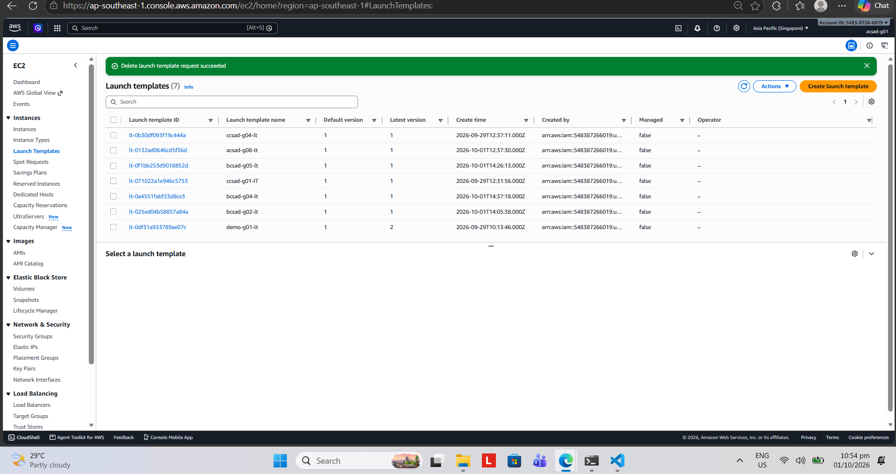

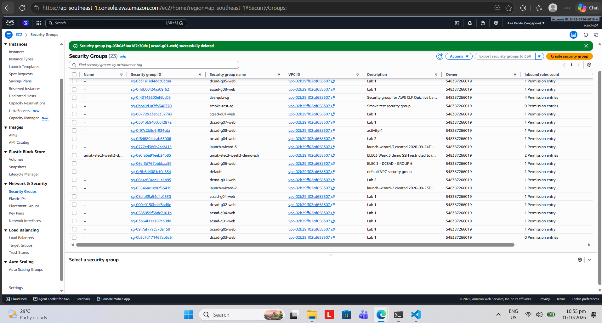

## Recorded observations

- Time /burn was started: The exact request time was not recorded. In the corrected run, `/burn` was opened on `54.151.163.46` before the high-CPU alarm triggered at 10:25:31 PM Philippine time (14:25:31 UTC) on October 1, 2026.
- Time the second instance became InService: In the corrected run, `i-0a94f341522f9fc8a` was confirmed InService and Healthy by 10:30 PM Philippine time (14:30 UTC). Its successful launch activity ended at 10:26:42 PM (14:26:42 UTC); the exact InService transition time was not recorded. In the initial run, the second instance's successful launch activity ended at 9:58:27 PM (13:58:27 UTC).
- Observed CPU utilization and alarm state: CPU peaked at approximately 100% and subsequently fell near 0%. With the corrected 30% target, the high-CPU alarm entered In alarm at 10:25:31 PM Philippine time (14:25:31 UTC), triggering scaling from 1 to 2 instances. Separately, the initial run's CloudWatch History records OK → In alarm at 13:53:10 UTC, successful scaling policy execution at the same time, and In alarm → OK at 13:59:10 UTC on October 1, 2026.
- Result after opening /stop: Initial run returned `Burn stopped.` at `http://47.131.225.190/stop`, followed by a CPU chart falling near 0%. Corrected run returned `Burn stopped.` at `http://54.151.163.46/stop`; its updated CPU chart also shows the latest spike falling near 0%.
- Auto Scaling group, launch template, and security group cleanup result: The team confirmed deletion of `acsad-g01-asg`, `acsad-g01-lt`, and `acsad-g01-web`. Cleanup screenshots were captured at approximately 10:53–10:55 PM Philippine time. They show ASG deletion in progress and successful launch-template/security-group deletion banners; the final ASG disappearance was confirmed by the team rather than captured in a refreshed screenshot.

## Questions

1. Why did the group stop at 2 instances?

   The group's maximum capacity was set to 2. The target tracking policy could increase desired capacity from 1 to 2, but could not exceed that configured limit even while CPU utilization remained above our 30% target. [AWS Auto Scaling group documentation](https://docs.aws.amazon.com/autoscaling/ec2/userguide/auto-scaling-groups.html)

2. Why did terminating an instance by hand not remove the cost?

   Terminating one instance did not change the group's desired capacity of 2. Auto Scaling detected the terminated instance and launched a replacement to maintain that capacity, so the remaining and replacement instances continued to incur EC2 usage charges. Our Activity History shows `i-0a94f341522f9fc8a` being replaced by `i-0c068db1206f2746c`. Deleting the group during cleanup ended its automatic replacement behavior and terminated its instances. [AWS Auto Scaling group documentation](https://docs.aws.amazon.com/autoscaling/ec2/userguide/auto-scaling-groups.html)

3. Why is the target value set to your assigned value (e.g., 30-85 percent) instead of 99 percent?

   Group 1's assigned value was 30%, which also distinguished our configuration from other teams as required by the lab. A target below full CPU utilization leaves spare capacity for demand increases while scaling is detected and new instances start. A 99% target leaves almost no buffer and risks poor response times before additional capacity becomes available. The appropriate production target depends on the workload; 30% was our assigned lab setting. [AWS target tracking documentation](https://docs.aws.amazon.com/autoscaling/ec2/userguide/as-scaling-target-tracking.html)

4. What did the automatic cutoff protect us from?

   The instructor's automatic cutoff protected us from leaving the Auto Scaling group and its EC2 instances running unintentionally after the lab, which would continue consuming resources and accumulating charges. It was separate from `/burn`'s eight-minute timeout, which only stopped the CPU load. We performed manual cleanup and did not record the cutoff itself taking effect.

5. What changes when a load balancer sits in front of the group?

   Clients use one load balancer endpoint instead of individual instance public IP addresses. The load balancer distributes incoming requests across healthy instances, and Auto Scaling automatically registers new instances and deregisters removed ones. This allows added capacity to serve traffic and helps maintain availability when an instance is replaced. It does not move an already-running `/burn` process from one instance to another. [AWS load balancer integration documentation](https://docs.aws.amazon.com/autoscaling/ec2/userguide/autoscaling-load-balancer.html)
